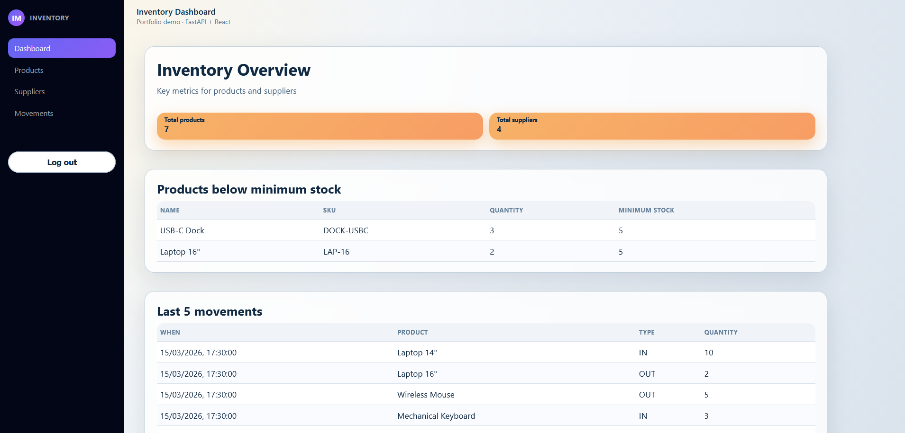
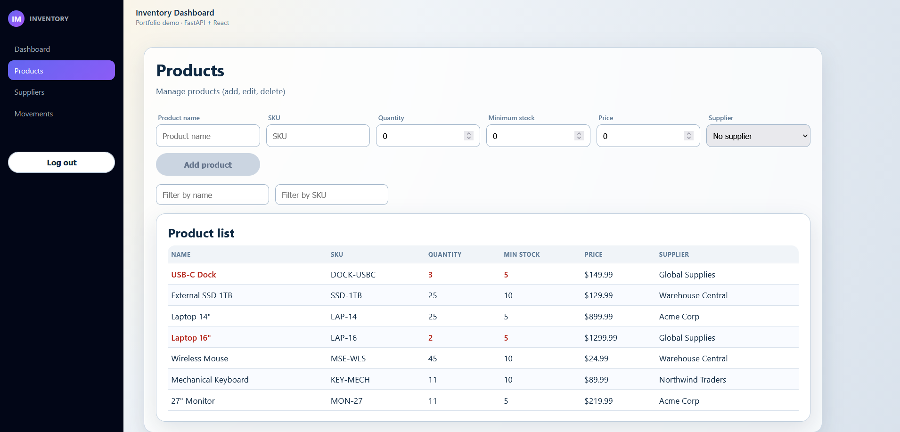
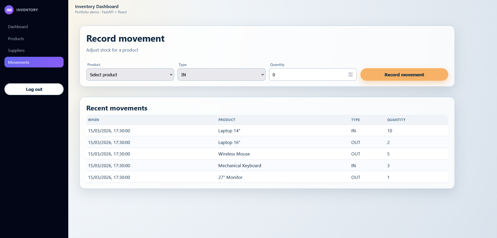
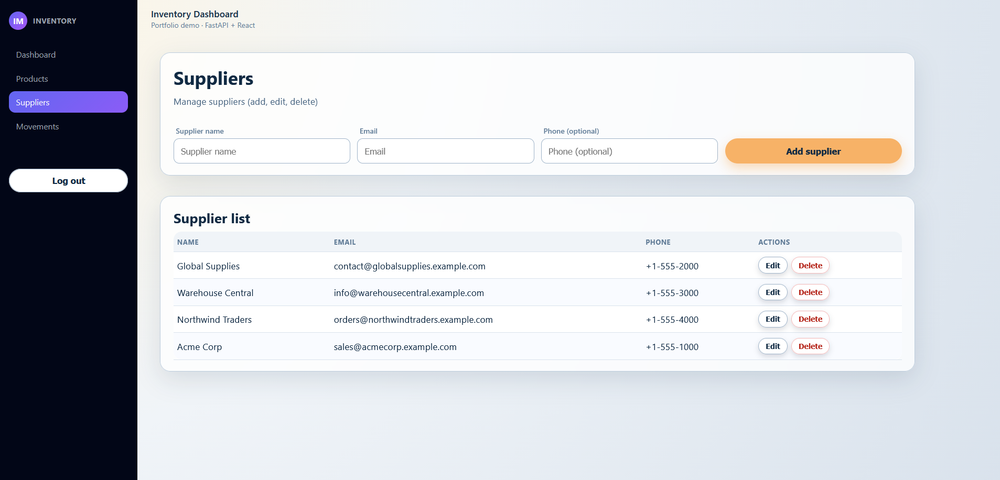

# Inventory Management System

Internal web application for managing products, suppliers, and stock movements.

Built as a realistic business tool to demonstrate backend, database, and full-stack development skills for internal operations software.  

Suitable as a foundation for small internal inventory systems or as a starting point for custom business tooling.

---

## Overview

This system allows organizations to:

- Track products and inventory levels
- Manage suppliers
- Record stock entries and exits
- Monitor low-stock items
- View recent activity
- Maintain an auditable history of movements

Designed for small-to-medium operations that need a lightweight internal inventory solution.

---

## Screenshots

<p align="center">
  Dashboard
</p>



<p align="center">
  Products
</p>



<p align="center">
  Movements
</p>



<p align="center">
  Suppliers
</p>



**Default credentials (if authentication enabled):**

```
username: admin
password: admin
```

---

## Features

### Core Functionality

- Product management (CRUD)
- Supplier management (CRUD)
- Stock movement tracking (IN / OUT)
- Automatic quantity updates
- Minimum stock thresholds
- Low-stock alerts
- Dashboard with key metrics
- Movement history

### Operational Features

- Relational data model
- Audit-friendly movement tracking
- Search and filtering
- Clean internal-tool UI
- Demo data seeding

---

## Tech Stack

### Backend

- FastAPI
- SQLAlchemy
- Alembic (database migrations)
- PostgreSQL
- Poetry (dependency management)

### Frontend

- React (Vite)

### Dev & Tooling

- Docker (PostgreSQL container)
- Just (task runner)
- Bash scripts

---

## Project Structure

```
backend/        FastAPI application  
frontend/       React application  
alembic/        Database migrations  
docker-compose.yml  PostgreSQL container  
justfile        Development task runner  
```

---

## Prerequisites

Install before running locally:

- Docker
- Python 3.11+
- Poetry
- Node.js 18+
- npm

---

## Quick Start (Recommended)

### 1) Install package dependencies

```
just up
```


### 2) Start database

```
just up
```

Starts PostgreSQL in Docker.

---

### 3) Run database migrations

```
just migrate
```

Creates all required tables.

---

### 4) Seed demo data (optional but recommended)

```
just seed
```

Populates suppliers, products, and stock movements for testing.

---

### 5) Start backend

```
just backend
```

Backend runs at:

```
http://localhost:8000
```

---

### 6) Start frontend

Open a new terminal:

```
just frontend
```

Frontend runs at:

```
http://localhost:5173
```

---

## Common Development Commands

### Start PostgreSQL

```
just up
```

### Stop PostgreSQL

```
just stop
```

---

### Apply latest migrations

```
just migrate
```

### Create new migration

```
just migration "description"
```

### Downgrade database

```
just downgrade <revision>
```

---

### Seed demo data

```
just seed
```

---

## Maintenance / Reset Commands

Use carefully.

### Drop and recreate database schema

```
just drop-tables
```

### Recreate base migration

```
just new-base-migration
```

### Clean Docker resources

```
just wipe-docker
```

---

## Data Model Overview

Main entities:

- Users
- Suppliers
- Products
- Stock Movements

Inventory levels are derived from movement history to preserve auditability.

---

## Development Notes

- Backend uses RESTful patterns
- Database schema managed via Alembic migrations
- Designed for extensibility (multi-warehouse, roles, reporting, etc.)
- Not intended as production-ready software without additional hardening

---

## Use Cases

Suitable as a starting point for:

- Internal inventory systems
- Warehouse tracking tools
- Asset management systems
- Operational dashboards
- Custom business software projects

---

## Author

Rafael Tolini  
Computer Science — PUC-Rio  
Backend / Data / Automation Development

---

## License

MIT License
